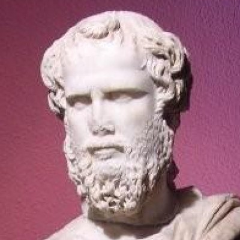

Colaboradores
====

Programação
----
Ghostkeeper - Versão 1.1 e posterior](../images/contributors/Ghostkeeper.png)
Alekseisasin - Versão 1.0](../images/contributors/Alekseisasin.png)

Artigos
----

Traduções
----

Laurent Lalliard - Francês](../images/contributors/5axes.png)

