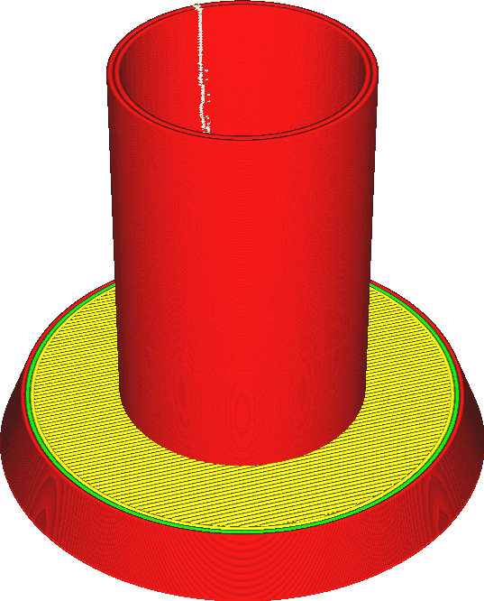
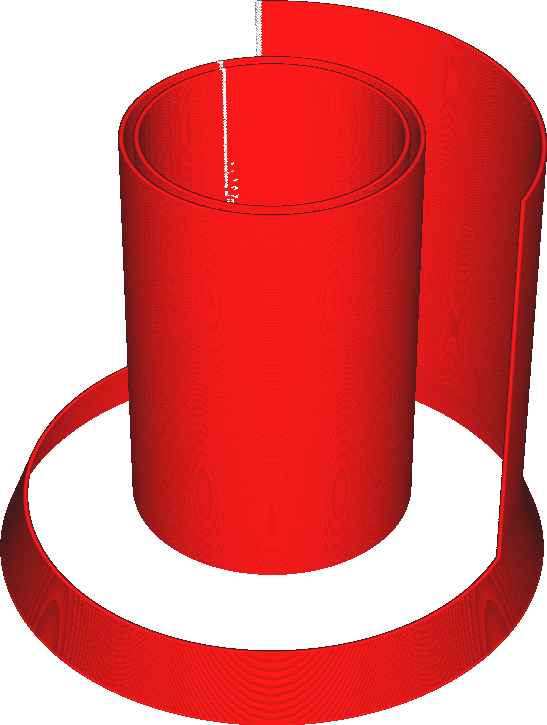
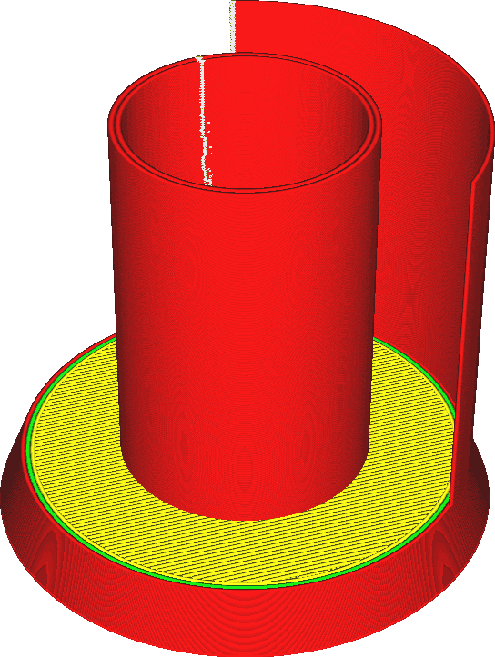

Modo de superfície
====
Normalmente, o Cura criará seções transversais de todos os triângulos da malha. Esses segmentos de linha são unidos para formar loops. Os loops que não estiverem fechados serão descartados.

Essa configuração controla o que será feito com esses loops não fechados. Se for definido como "Normal", eles serão descartados. Se estiver definida como "Surface", todas as seções transversais serão impressas como contornos. Se definido como "Both", os contornos fechados serão impressos normalmente, mas os não fechados serão impressos separadamente como paredes extras.

<!--screenshot {
"image_path": "magic_mesh_surface_mode_normal.png",
"models": [{"script": "extra_surface.py"}],
"camera_position": [66, 129, 124],
"settings": {
    "magic_mesh_surface_mode": "normal"
},
"colours": 32
}-->
<!--screenshot {
"image_path": "magic_mesh_surface_mode_surface.png",
"models": [{"script": "extra_surface.py"}],
"camera_position": [66, 129, 124],
"settings": {
    "magic_mesh_surface_mode": "surface"
},
"colours": 32
}-->
<!--screenshot {
"image_path": "magic_mesh_surface_mode_both.png",
"models": [{"script": "extra_surface.py"}],
"camera_position": [66, 129, 124],
"settings": {
    "magic_mesh_surface_mode": "both"
},
"colours": 32
}-->

Modo de superfície
====
Normalmente, o Cura criará seções transversais de todos os triângulos da malha. Esses segmentos de linha são unidos para formar loops. Os loops que não estiverem fechados serão descartados.

Essa configuração controla o que será feito com esses loops não fechados. Se for definido como "Normal", eles serão descartados. Se estiver definida como "Surface", todas as seções transversais serão impressas como contornos. Se definido como "Both", os contornos fechados serão impressos normalmente, mas os não fechados serão impressos separadamente como paredes extras.

<!--screenshot {
"image_path": "magic_mesh_surface_mode_normal.png",
"models": [{"script": "extra_surface.py"}],
"camera_position": [66, 129, 124],
"settings": {
    "magic_mesh_surface_mode": "normal"
},
"colours": 32
}-->
<!--screenshot {
"image_path": "magic_mesh_surface_mode_surface.png",
"models": [{"script": "extra_surface.py"}],
"camera_position": [66, 129, 124],
"settings": {
    "magic_mesh_surface_mode": "surface"
},
"colours": 32
}-->
<!--screenshot {
"image_path": "magic_mesh_surface_mode_both.png",
"models": [{"script": "extra_surface.py"}],
"camera_position": [66, 129, 124],
"settings": {
    "magic_mesh_surface_mode": "both"
},
"colours": 32
}-->

As superfícies extras que são impressas incluirão apenas as superfícies verticais como linhas simples. Não há técnica de preenchimento para superfícies horizontais, pois as superfícies não são polígonos fechados. Elas não podem ser preenchidas, pois não há interior. Não pode haver partes superiores, inferiores, preenchimento ou suportes. Somente linhas simples.

As superfícies extras serão impressas como se fossem paredes externas, portanto, serão afetadas pela velocidade de impressão da parede externa, pela largura da linha e assim por diante. Ele também imprimirá essas superfícies usando uma linha precisamente centralizada na superfície, em vez de alinhar a linha ao longo do interior do modelo. Isso significa que ela se estende com metade da largura da linha em cada lado da superfície. Isso acontece porque é ambíguo qual lado da superfície é o interior do modelo. Sua impressão não será dimensionalmente precisa. Se, como na captura de tela acima, a superfície extra estiver alinhada com uma superfície sólida normal e você estiver usando a opção "Both" (Ambos) para completar as paredes que faltam, as camadas não serão alinhadas corretamente.

**Se estiver imprimindo os volumes normais e as superfícies extras, lembre-se de que os volumes serão impressos com a parede externa completamente dentro do volume. As superfícies extras são impressas com a linha centralizada na superfície, com metade da largura da linha em cada lado. Se uma superfície extra estiver alinhada à superfície de um volume fechado, como nas figuras acima, a superfície será deslocada por meia largura de linha. Afinal de contas, a superfície extra não tem um interior para onde se mover.**