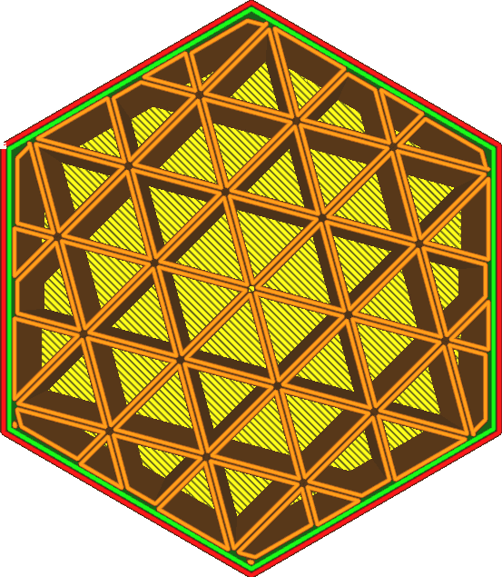
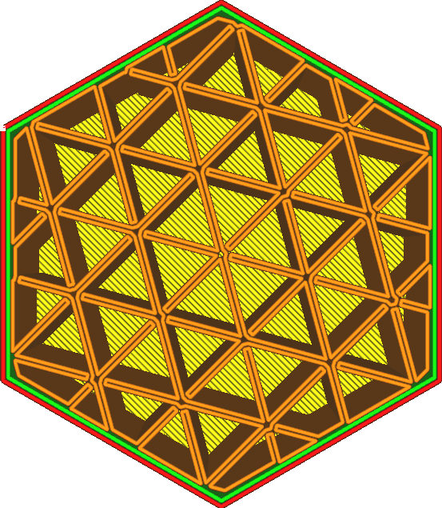

Conectar polígonos de preenchimento
====
Quando o preenchimento consiste em loops fechados, esses loops fechados podem ser fundidos para formar um único loop. A ativação dessa opção fará pequenas conexões onde os polígonos são adjacentes.

Essa configuração só está disponível quando o preenchimento consiste em loops adjacentes uns aos outros. Isso significa que:
* O [padrão de preenchimento](infill_pattern.md) está definido como Cross ou Cross 3D.
* As linhas de preenchimento estão [multiplicadas](infill_multiplier.md) em um número par.
* Há pelo menos 2 [paredes extras ao redor do preenchimento](infill_wall_line_count.md).

<!--screenshot {
"image_path": "connect_infill_polygons_disabled.png",
"models": [{"script": "hexagonal_prism.scad"}],
"camera_position": [0, 0, 180],
"settings": {
    "top_layers": 0,
    "infill_pattern": "triangles",
    "infill_multiplier": 2,
    "zig_zaggify_infill": true,
    "connect_infill_polygons": false
},
"colours": 32
}-->
<!--screenshot {
"image_path": "connect_infill_polygons_enabled.png",
"models": [{"script": "hexagonal_prism.scad"}],
"camera_position": [0, 0, 180],
"settings": {
    "top_layers": 0,
    "infill_pattern": "triangles",
    "infill_multiplier": 2,
    "zig_zaggify_infill": true,
    "connect_infill_polygons": true
},
"colours": 32
}-->

O objetivo dessa função é evitar movimentos de deslocamento. A linha final será um único loop para cada parte conectada do preenchimento, portanto, não haverá movimentos de deslocamento. Isso facilita o trabalho com filamentos flexíveis, pois eles são mais difíceis de retrair e funcionam melhor se puderem continuar fluindo pelo bocal.

Conectar esses loops também pode tornar o preenchimento mais forte, aprimorando a conexão entre os loops internamente. No entanto, quando os polígonos são conectados, o cabeçote de impressão geralmente precisa fazer curvas de 180 graus logo antes de uma junção. Essas curvas às vezes impedem que a junção seja totalmente conectada. Isso também pode tornar o preenchimento mais fraco em alguns casos. Tudo depende de como os loops se encaixam na forma de seu modelo.