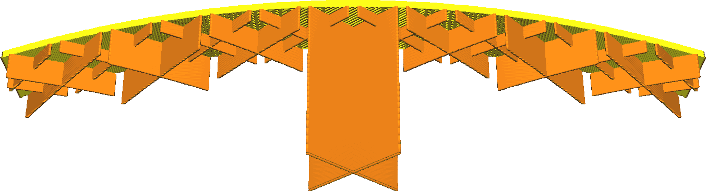

Altura do degrau de preenchimento gradual
====
Ao usar o preenchimento gradual, a densidade do preenchimento será reduzida de cima para baixo em vários passos. Em cada passo, a densidade do preenchimento é reduzida à metade. Essa configuração indica a altura dessas passos, a distância entre dois locais onde o preenchimento é reduzido à metade.

<!--screenshot {
"image_path": "gradual_infill_step_height_small.png",
"models": [{"script": "curved_top.scad"}],
"camera_position": [0, 137, -62],
"settings": {
    "wall_line_count": 0,
    "bottom_layers": 0,
    "gradual_infill_steps": 3,
    "gradual_infill_step_height": 1.5
},
"colours": 16
}-->
<!--screenshot {
"image_path": "gradual_infill_step_height_large.png",
"models": [{"script": "curved_top.scad"}],
"camera_position": [0, 137, -62],
"settings": {
    "wall_line_count": 0,
    "bottom_layers": 0,
    "gradual_infill_steps": 3,
    "gradual_infill_step_height": 5
},
"colours": 16
}-->

O preenchimento gradual, por sua natureza, suspenderá parte do preenchimento no ar. No entanto, isso normalmente se repara automaticamente. A primeira camada de preenchimento ficará suspensa no ar e só se fixará corretamente nas laterais da impressão. As camadas colocadas em cima dela podem se apoiar um pouco na camada anterior nas extremidades, mas ainda assim ficarão caídas no meio. Isso melhora gradualmente, camada por camada.

* Reduza o gradiente do preenchimento gradual para descer rapidamente a uma baixa densidade de preenchimento. Isso economiza tempo de impressão e uso de material.
* Aumente o gradiente do preenchimento gradual se o preenchimento não tiver espaço suficiente para se reparar até o momento em que ocorrer a próximo passo na densidade do preenchimento. Aumentar o valor dessa configuração torna a impressão mais confiável.