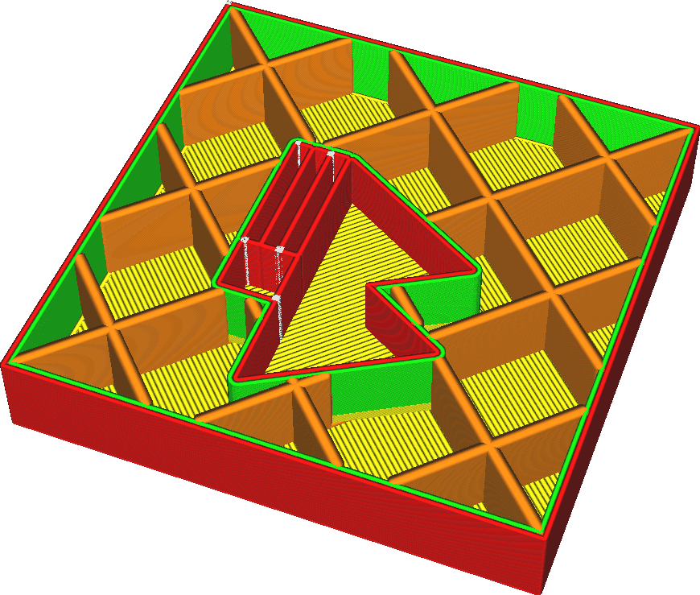

Largura da linha de preenchimento
====
A largura de cada linha de preenchimento sendo desenhada. A largura de uma linha pode ser diferente do tamanho do bocal simplesmente extrudando mais ou menos material do que o necessário. Se mais material for extrudado, o plástico fluirá para os lados, tornando a linha mais grossa. Se menos material for extrudado, a tensão superficial do material tende a puxá-lo em direção à linha central do caminho do bocal.

<!--screenshot {
"image_path": "infill_line_width.png",
"models": [{"script": "material_calibration.scad"}],
"camera_position": [35, 92, 122],
"settings": {"infill_line_width": 1},
"layer": 111,
"colours": 64
}-->

Aumentar as linhas de preenchimento pode tornar sua impressão mais forte e também reduzir o tempo de impressão. No entanto, aumentá-lo demais pode causar grandes flutuações na extrusão. Isso causará subextrusão ao imprimir o preenchimento e superextrusão ao imprimir o que vier depois do preenchimento, porque o fluxo através do bocal não pode se ajustar rápido o suficiente.

**As linhas de preenchimento reais podem ficar mais largas do que esta configuração indica, se você tiver ajustado a configuração [Espessura da camada de preenchimento](../infill/infill_sparse_thickness.md).**