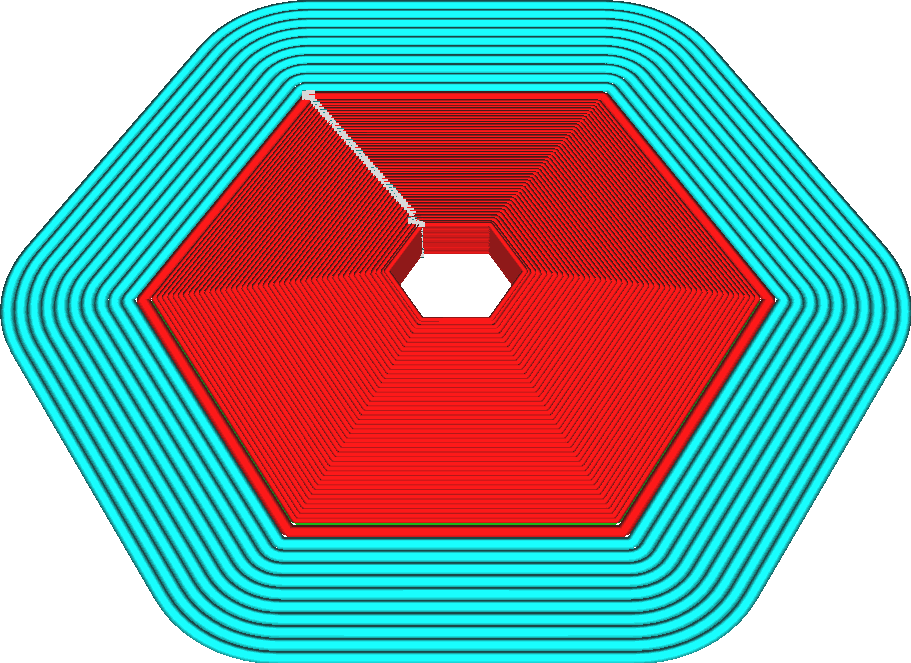

Largura da linha da camada inicial
====
Isso torna as linhas na camada inicial mais largas ou mais finas em uma determinada proporção.

<!--screenshot {
"image_path": "initial_layer_line_width_factor.png",
"models": [{"script": "hex_foot.scad"}],
"camera_position": [0, 92, 122],
"settings": {
    "adhesion_type": "brim",
    "initial_layer_line_width_factor": 200
},
"colours": 32
}-->

O objetivo dessa configuração é melhorar a adesão à placa de construção. Para imprimir linhas mais largas, o bocal precisa extrudar mais material e esse material precisa fluir mais para fora. Isso faz com que o bocal pressione o material com mais força na placa de impressão, o que aumenta a aderência entre o filamento e a placa de impressão.
* As linhas não serão apenas mais largas ou mais finas, mas também serão mais distantes ou mais próximas pelo mesmo fator, de modo que isso não produziria superextrusão ou subextrusão.
* Essa configuração afeta todas as larguras de linha: pele, paredes, adesão, suporte, a torre principal e assim por diante. Elas se tornarão mais largas ou mais finas na mesma proporção.