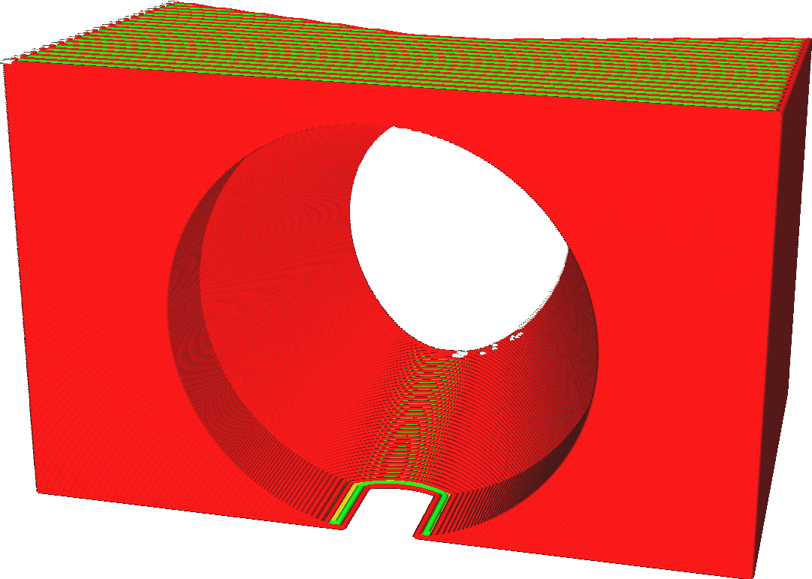
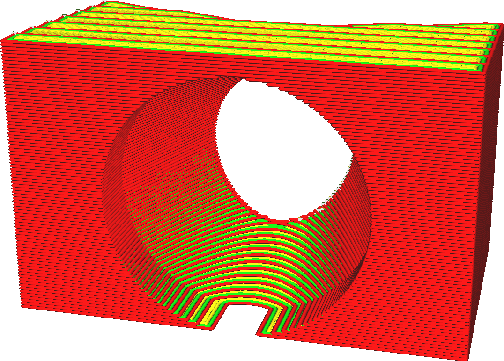

Altura da camada
====
A impressora 3D coloca o plástico em camadas. A altura da camada é a espessura dessas camadas em milímetros. É o fator mais importante na qualidade visual de sua impressão final e no tempo de impressão.

<!--screenshot {
"image_path": "layer_height_0.1.png",
"models": [{"script": "plunger_stop.scad"}],
"camera_position": [25, 100, 50],
"settings": {"layer_height": 0.1},
"colours": 32
}-->
<!--screenshot {
"image_path": "layer_height_0.3.png",
"models": [{"script": "plunger_stop.scad"}],
"camera_position": [25, 100, 50],
"settings": {"layer_height": 0.3},
"colours": 32
}-->

A altura da camada é a configuração mais importante para afetar a qualidade geral e, inversamente, o tempo de impressão. Estes são apenas alguns dos efeitos:
* Ter camadas mais finas aumentará a qualidade visual da impressão. Como as camadas são mais finas, o efeito de degrau de escada nas bordas da camada será reduzido. Além disso, as camadas ficarão mais próximas umas das outras e, portanto, os vincos entre as camadas serão menores, o que resultará em um acabamento geral mais suave.
* Ter camadas mais finas permite que a impressora produza mais detalhes nos lados superior e inferior da impressão.
* Ter camadas mais grossas tende a tornar a impressão mais forte, até certo ponto. Haverá menos bordas entre as camadas, que tendem a ser um ponto fraco. As camadas mais grossas não serão tão cortadas.
* A utilização de camadas mais espessas reduzirá o tempo de impressão, pois o bocal não precisará fazer tantos movimentos horizontais.

Altura da camada vs. perfis
----
Muitas configurações dependem da altura da camada. Como a altura da camada afeta significativamente a taxa de fluxo do material através do bocal, muitos parâmetros do processo de impressão serão alterados. Isso é muito complexo. Por exemplo, ao aumentar a altura da camada, você provavelmente deve aumentar um pouco a temperatura de impressão para compensar a taxa extra de perda de calor. A temperatura, então, afeta a liquidez do material, o que afetará a nitidez dos cantos e o resfriamento necessário, e assim por diante. É sempre aconselhável começar com um perfil de qualidade pré-fabricado disponível para sua impressora que tenha uma altura de camada próxima à que você deseja.

Você pode escolher uma altura de camada desejada no Modo personalizado, mas os perfis pré-fabricados também estão disponíveis com várias alturas de camada. Você pode escolher entre perfis para várias alturas de camada no Modo recomendado usando um controle deslizante ou usando o widget suspenso no Modo personalizado. Como esses perfis também alteram alguns parâmetros que dependem da altura da camada, você provavelmente obterá uma qualidade melhor dessa forma.

Observações adicionais
----
Em alturas de camada muito baixas, você pode esbarrar no limite de resolução do eixo Z. Consulte o tamanho do passo do eixo Z de sua impressora e certifique-se de que a altura da camada seja um múltiplo desse valor. Se não corresponder corretamente, algumas camadas serão mais grossas do que outras, o que resultará em faixas.

**Observe que a configuração da altura da camada não é válida para a camada inicial da impressão nem para as camadas de jangada, que têm suas próprias configurações para ajustar a altura da camada separadamente. Ao usar camadas adaptáveis, essa configuração de altura da camada será usada como linha de base, mas a altura real da camada terá alguma variação.**