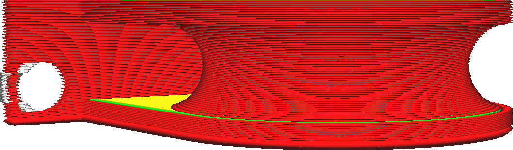

Altura da camada inicial
====
Essa configuração define a espessura da primeira camada de sua impressão. Normalmente, a camada inicial é impressa mais espessa que as demais para criar uma adesão mais forte com a placa de impressão. Com essa configuração, a espessura da camada inicial pode ser aumentada sem reduzir a resolução do restante da impressão.

<!--screenshot {
"image_path": "layer_height_0.png",
"models": [
    {
        "script": "rolling_blind_spacer.scad",
        "transformation": ["scale(0.5)"]
    }
],
"camera_position": [39, 28, 5],
"settings": {"layer_height_0": 0.3},
"colours": 32
}-->

O aumento da espessura da camada inicial faz com que o bocal extrude mais material na mesma distância. Isso requer força extra, pois o material se espalha para os lados para preencher toda a largura da linha. Essa força extra faz com que o material adira melhor à placa de construção. Além disso, a camada mais espessa captará quaisquer irregularidades na planicidade da superfície. Se a placa de impressão estiver levemente dobrada, a variabilidade será absorvida pela espessura da primeira camada, ao passo que, de outra forma, o bico poderia raspá-la na segunda camada.

Ter uma camada inicial muito espessa faz com que a primeira camada caia mais, o que causa pés de elefante. A configuração [Expansão horizontal da camada inicial](../shell/xy_offset_layer_0.md) pode evitar isso, fornecendo-lhe um pequeno valor negativo.