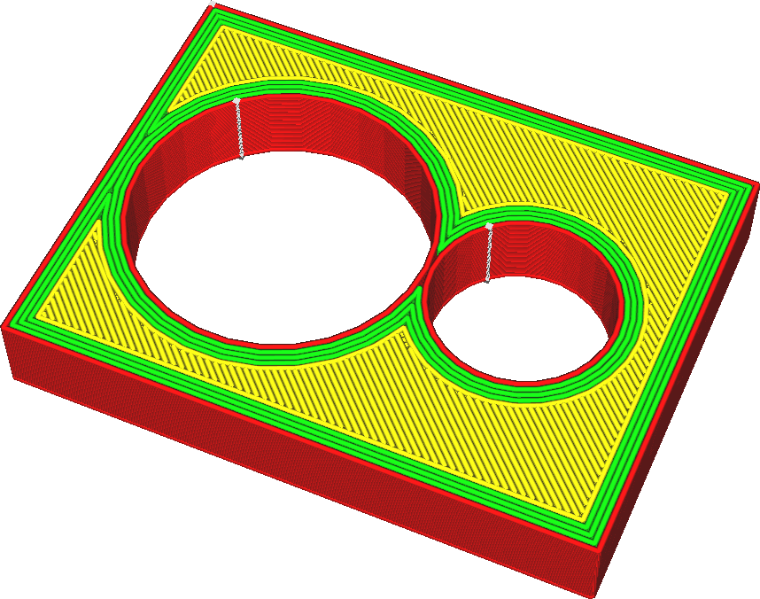
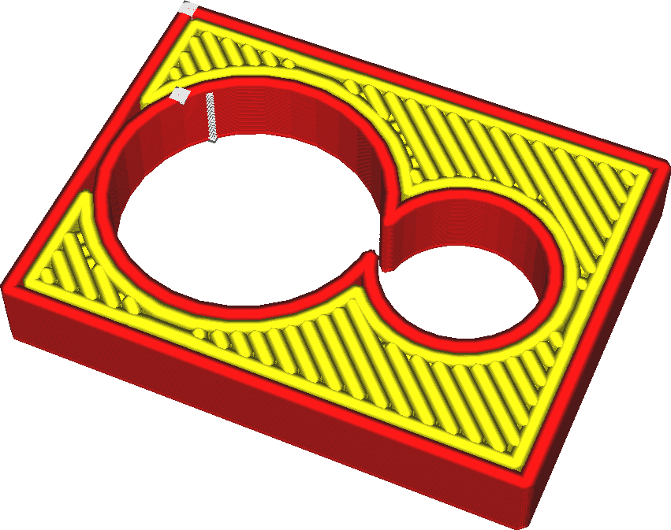
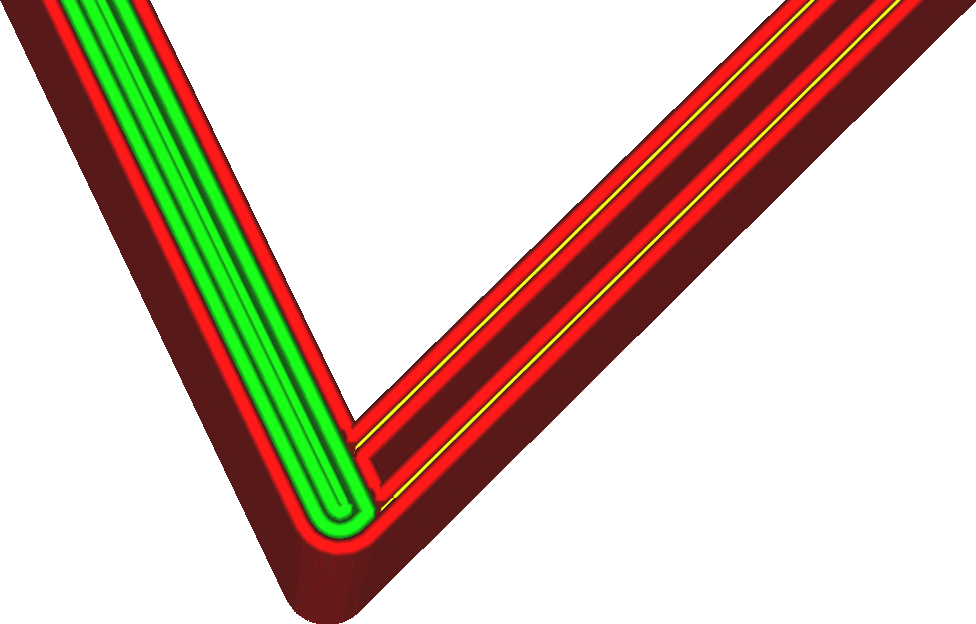
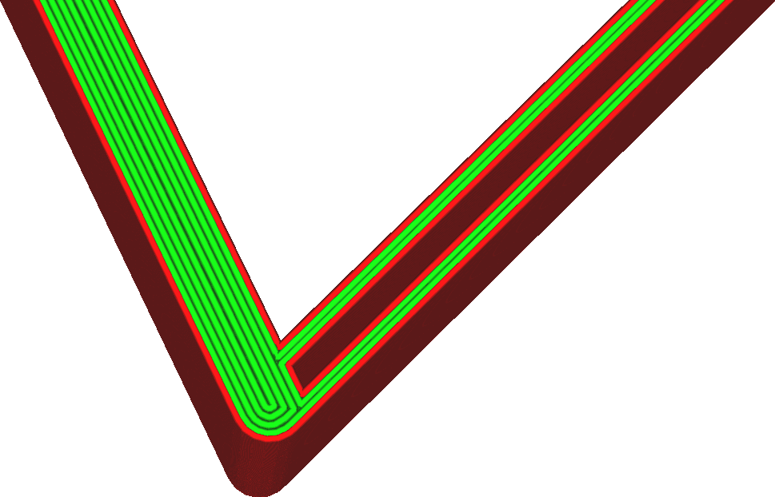

Largura da linha
====
Essa é a largura horizontal das linhas que a impressora colocará. Normalmente, o diâmetro da abertura do bocal determina a largura das linhas, mas, ao extrudar mais ou menos material, a impressora pode variar um pouco a largura das linhas.

<!--screenshot {
"image_path": "line_width_small.png",
"models": [{"script": "holes_cutout.scad"}],
"camera_position": [17, 39, 61],
"settings": {"line_width": 0.2},
"colours": 64
}-->
<!--screenshot {
"image_path": "line_width_large.png",
"models": [{"script": "holes_cutout.scad"}],
"camera_position": [17, 39, 61],
"settings": {"line_width": 0.6},
"colours": 32
}-->

A redução da largura da linha permite que a impressora imprima mais detalhes. Em particular, ela também permite que a impressora imprima partes finas. A largura da linha é uma das configurações mais influentes em sua impressão. Aqui estão alguns dos efeitos:
* A impressão de linhas mais finas permitirá que peças mais finas sejam impressas, pois é possível encaixar uma linha até mesmo nas peças mais finas.
* Ajustar a largura da linha para um múltiplo uniforme da espessura de sua impressão pode tornar o objeto mais forte e fazer com que o material flua melhor.
* Uma largura de linha menor fará com que a superfície superior pareça mais suave.
* Imprimir linhas ligeiramente menores do que o tamanho do bocal tende a aumentar a resistência. Isso permite que o bocal funda as linhas adjacentes quando faz uma segunda passagem ligeiramente acima da linha anterior.
* A impressão de linhas muito largas levará à subextrusão. A impressora tentará extrudar mais material, o suficiente para preencher a largura desejada da linha. Esse material tentará fluir em qualquer direção que puder. Entretanto, em algum momento, a contrapressão se tornará muito grande, de modo que o material não fluirá mais até o lado das linhas muito largas. Isso deixa lacunas entre as linhas.
* A impressão de linhas muito pequenas também leva à subextrusão. Se o material não fluir com rapidez suficiente pelo bocal, a tensão superficial do material fará com que ele coagule em pequenas gotas, tornando a extrusão irregular e deixando lacunas entre as gotas.
* A impressão de linhas mais finas aumentará consideravelmente o tempo de impressão.

Não é aconselhável reduzir a largura da linha abaixo de 60% do tamanho do bocal ou acima de 150%. Ambos podem não conseguir extrudar material suficiente.

<!--if cura_version>=5.0-->Em peças finas, a largura da linha será automaticamente ajustada para se adequar à largura local da peça. Não há necessidade de garantir que a largura da peça seja um múltiplo da largura da linha. O [Ângulo de limite de transição de parede](../shell/wall_transition_angle.md) determina onde a largura da linha é ajustada automaticamente em cantos agudos. A [Largura mínima da linha da parede](../shell/min_wall_line_width.md) determina até que ponto elas podem ser ajustadas em cada direção.
<!--endif-->

<!--if cura_version<5.0:
Ajuste da largura das linhas para caber em paredes suficientes
----
Ao imprimir objetos mecânicos que precisam ser finos, mas resistentes, você regularmente se depara com o problema de que a peça não é um múltiplo uniforme e limpo da largura da linha. Se não for um múltiplo uniforme, o Cura normalmente reduzirá o fluxo de algumas das linhas devido à [ 
Compensar sobreposições de parede 
](../shell/travel_compensate_overlapping_walls_enabled.md). Isso altera a taxa de fluxo através do bocal, o que prejudica a qualidade visual. Se for um múltiplo limpo da largura da linha, mas não um número par, uma das paredes será reduzida a 0.

A produção de contornos limpos com linhas uniformes pode tornar a impressão mais forte e com melhor aparência. Uma habilidade marcante de qualquer usuário experiente do Cura é poder ajustar a largura da linha de modo que o número desejado de contornos preencha a impressão.

-->
Mantendo o fluxo constante
----
Grandes flutuações no fluxo às vezes são problemáticas para as impressoras FDM. A câmara do bocal mantém algum material sob pressão, o que faz com que a taxa de fluxo real do bocal seja atrasada. Levará algum tempo para que a taxa de fluxo aumente ou diminua. As impressoras com um sistema Bowden para alimentar o filamento também têm elasticidade no tubo Bowden, o que torna o efeito muito pior. Como resultado disso, você terá uma subextrusão ao mudar para uma taxa de fluxo mais alta e uma superextrusão ao mudar para uma taxa de fluxo mais baixa. Portanto, é uma boa ideia manter a taxa de fluxo o mais constante possível.

A largura da linha influencia muito a taxa de fluxo. É aconselhável manter as larguras das linhas próximas umas das outras e próximas do tamanho do bocal. Se ajustar a largura da linha de forma significativa, você pode considerar ajustar a velocidade de impressão também para manter a taxa de fluxo mais constante. Isso melhorará a precisão dimensional de sua impressão.