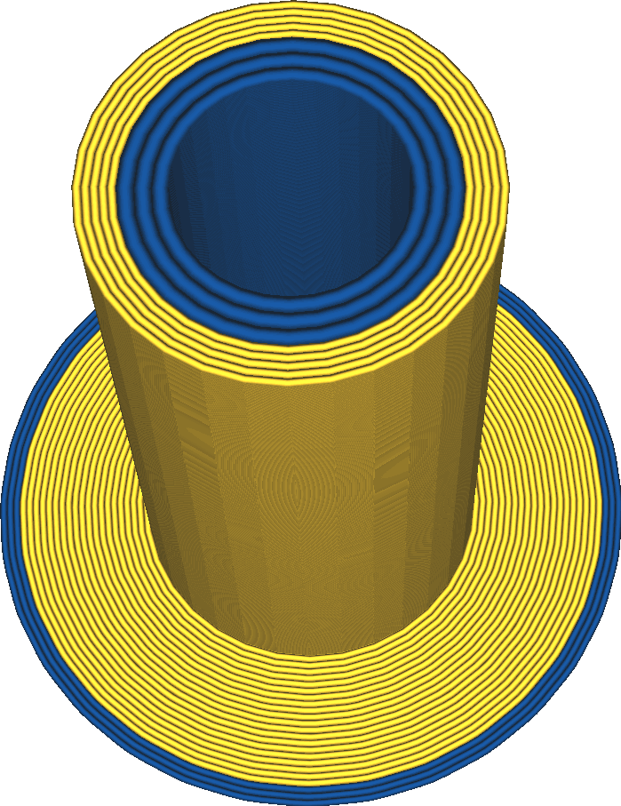

Largura da linha da torre principal
====
Essa configuração determina a largura das linhas com as quais a torre principal é desenhada.

<!--screenshot {
"image_path": "prime_tower_line_width.png",
"models": [
    {"script": "cube.scad"},
    {
        "script": "cube.scad",
        "object_settings": {"extruder_nr": 1},
        "transformation": ["translateX(40)"]
    }
],
"camera_position": [475, -419, 131],
"camera_lookat": [475, -465, 20],
"settings": {
    "prime_tower_enable": true,
    "[1]prime_tower_line_width": 0.8
},
"colour_scheme": "material_colour",
"colours": 64
}-->

A escolha de uma largura de linha mais grossa faz com que a torre principal seja impressa mais rapidamente. Se o volume extrudado por um contorno for suficientemente grande, o aumento da largura da linha tornará desnecessário outro loop. No entanto, aumentar demais a largura da linha pode enfraquecer a torre principal porque não é possível extrudar material suficiente com rapidez suficiente.