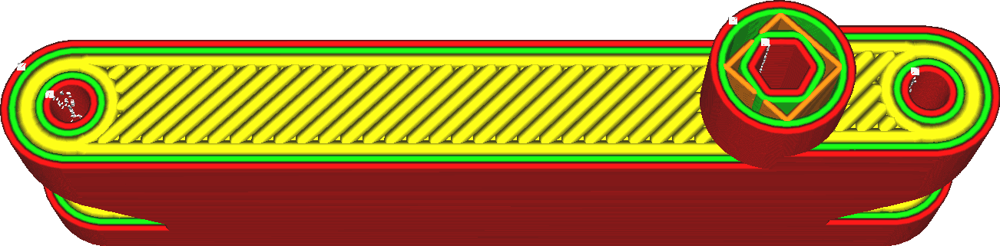

Largura da linha superior/inferior
====
A largura de cada linha da parte superior e inferior que está sendo desenhada. A largura de uma linha pode ser diferente do tamanho do bocal simplesmente pela extrusão de mais ou menos material do que o necessário. Se mais material for extrudado, o plástico fluirá em direção às laterais, tornando a linha mais espessa. Se for extrudado menos material, a tensão superficial do material tende a puxar o material em direção à linha central do caminho do bocal.

<!--screenshot {
"image_path": "skin_line_width.png",
"models": [
    {
        "script": "flipper_grip.scad",
        "transformation": ["scale(0.6)"]
    }
],
"camera_position": [0, 37, 107],
"settings": {"skin_line_width": 0.8},
"layer": 300,
"colours": 64
}-->

Tornar as linhas de pele mais largas é uma maneira fácil de reduzir o tempo de impressão, pois serão necessárias menos linhas para imprimir os lados superior e inferior do objeto. No entanto, aumentá-las demais pode causar grandes flutuações de extrusão. Isso causará subextrusão ao imprimir a pele e superextrusão ao imprimir o que vier em seguida, porque o fluxo através do bocal não pode se ajustar com rapidez suficiente. Aumentar a largura da linha da pele também aumentará a chance de aparecerem buracos na superfície, o que não é bonito e impede que ela seja estanque.

Reduzir a largura das linhas de revestimento tende a produzir uma superfície superior mais bonita, mas com um grande custo de tempo de impressão. Geralmente, é mais eficaz usar uma técnica diferente, como [Passar a ferro](../top_bottom/ironing_enabled.md) ou ajustar apenas as [Linhas de superfície superior](../top_bottom/roofing_line_width.md).