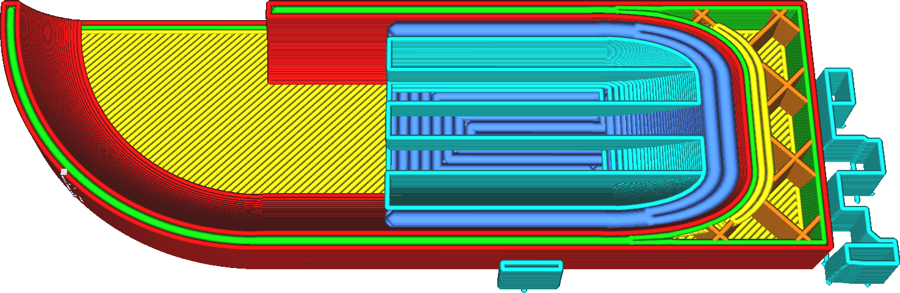

Largura da linha inferior do suporte
====
Essa configuração ajusta a largura das linhas da parte inferior do suporte.

<!--screenshot {
"image_path": "support_bottom_line_width.png",
"models": [
    {
        "script": "gutter_lift.scad",
        "transformation": ["mirrorZ", "scale(0.5)"]
    }
],
"camera_position": [-45, 0, 104],
"camera_lookat": [0, 0, 3],
"settings": {
    "support_enable": true,
    "support_bottom_enable": true,
    "support_bottom_line_width": 0.8
},
"layer": 65,
"colours": 64
}-->

A impressão de linhas mais finas tende a reduzir a adesão onde o suporte se fixa no modelo. No entanto, isso também torna a adesão mais constante e confiável. Em geral, isso torna o suporte mais fácil de remover e deixa menos cicatrizes no objeto. Obviamente, a impressão de linhas mais finas também leva mais tempo de impressão.