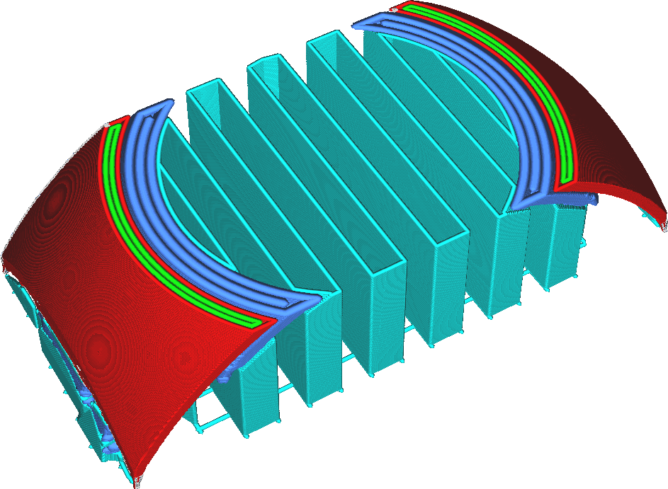

Largura da linha da interface de suporte
====
As larguras das linhas da interface de suporte podem ser configuradas separadamente das larguras do restante das linhas de suporte.

<!--screenshot {
"image_path": "support_roof_line_width.png",
"models": [
    {
        "script": "trash_bin_lid.scad",
        "transformation": ["scale(0.5)"]
    }
],
"camera_position": [-47, 79, 110],
"settings": {
    "support_enable": true,
    "support_roof_enable": true,
    "support_roof_line_width": 0.8
},
"layer": 192,
"colours": 64
}-->

Imprimir a interface de suporte com linhas um pouco mais finas geralmente é vantajoso para a qualidade da superfície suspensa que ela suporta, puramente por ter uma superfície superior mais lisa acima da interface de suporte. No entanto, isso não aumenta necessariamente a adesão entre a interface de suporte e o modelo, de modo que o suporte não será necessariamente mais difícil de remover.

Da mesma forma, a base do suporte aderirá mais uniformemente, reduzindo as cicatrizes onde o suporte estava apoiado no modelo sem tornar o suporte mais fraco.

No entanto, imprimir as linhas de interface muito finas causará extrusão irregular, o que reduz o efeito de suporte da interface, causando uma pior qualidade de saliência e um suporte menos estável. Isso também pode introduzir uma grande mudança na taxa de fluxo através do bocal, causando superextrusão quando começar a imprimir a interface de suporte e subextrusão ao imprimir o que vier depois da interface de suporte.