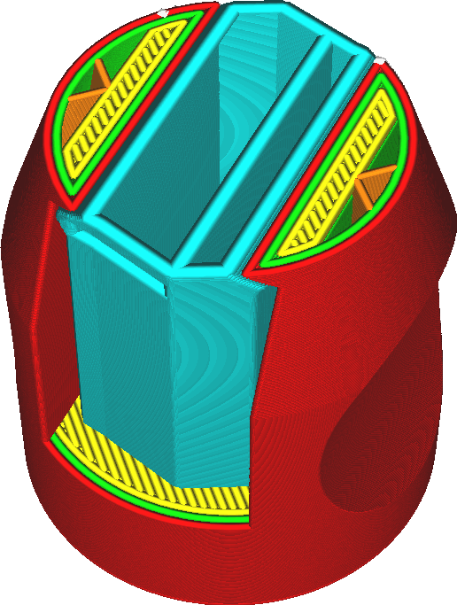

Largura da linha de suporte
====
A largura das linhas com as quais o suporte é desenhado pode ser diferente da largura da linha do restante da impressão.

<!--screenshot {
"image_path": "support_line_width.png",
"models": [
    {
        "script": "clamp.scad",
        "transformation": ["scale(0.5)"]
    }
],
"camera_position": [28, 57, 90],
"settings": {
    "support_enable": true,
    "support_line_width": 0.8
},
"layer": 350,
"colours": 128
}-->

O suporte geralmente não precisa ser impresso com precisão, portanto, pode ser impresso com uma largura de linha maior para economizar tempo, sem comprometer a resistência do suporte. No entanto, para obter a mesma densidade para o suporte, as linhas serão mais espaçadas. Isso reduz a qualidade das superfícies salientes de sua impressão.