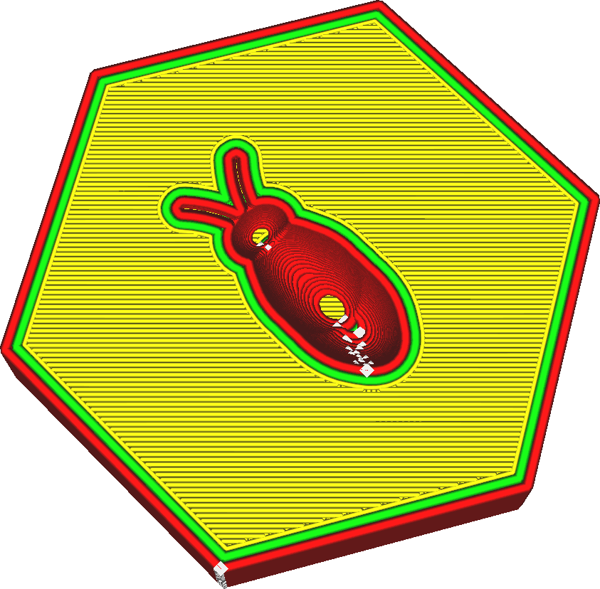

Largura de extrusão da parede
====
A largura de extrusão das paredes pode ser ajustada separadamente do restante da impressão. Essa configuração indica a largura das linhas individuais da parede.

<!--screenshot {
"image_path": "wall_line_width.png",
"models": [{"script": "hive.scad"}],
"camera_position": [-31, -31, 147],
"settings": {
    "wall_line_count": 2,
    "wall_line_width": 0.8
},
"colours": 64
}-->

Sabe-se que a redução das paredes para uma largura de linha ligeiramente abaixo do tamanho do bocal é benéfica para a resistência. O bocal extrudará um pouco menos de material, mas sua abertura se sobreporá às linhas das paredes adjacentes. Isso faz com que o material seja empurrado para o lado pela parede colocada anteriormente em seu local adequado. Mas isso também fará com que o plástico se funda melhor com as paredes adjacentes. Isso permite que as paredes se fundam melhor para poderem combinar sua resistência. Isso melhora muito a resistência das paredes.

A redução da largura de extrusão da parede também permite que o bocal imprima detalhes mais finos. Especialmente a [Largura de extrusão da parede externa](wall_line_width_0.md) é importante para essa propriedade.

Aumentar a largura de extrusão da parede pode reduzir o tempo de impressão. Você precisará de menos linhas de parede para obter peças com resistência semelhante. A resistência ainda será um pouco reduzida porque as paredes adjacentes não se fundirão tanto.

<!--if cura_version>=5.0-->
Em peças finas, a largura de extrusão será ajustada automaticamente para se adequar à largura local da peça. Não há necessidade de garantir que a largura da peça seja um múltiplo da largura de extrusão. O [Ângulo-limite de Transição da Parede](../shell/wall_transition_angle.md) determina onde a largura de extrusão é ajustada automaticamente em cantos agudos. A [Largura mínima de extrusão da parede](../shell/min_wall_line_width.md) determina o quanto elas podem ser ajustadas em cada direção.
<!--endif-->

<!--if cura_version<5.0:
Ajuste de linhas
----
Ao imprimir peças finas, o ajuste da largura de extrusão da parede é uma ferramenta importante para obter peças precisas e resistentes. O Cura só desenhará contornos completos, portanto, se um contorno não se encaixar, haverá uma lacuna nas paredes, o que compromete muito a resistência e a precisão da peça.

O Cura tentará preencher essas lacunas entre as paredes se a opção [Preencher lacunas entre as paredes](../shell/fill_perimeter_gaps.md) estiver ativada, mas essa técnica não é ideal para formas arbitrárias e geralmente leva muito tempo de impressão. Quando duas paredes se sobrepõem, o recurso [Compensar sobreposições de parede](../shell/travel_compensate_overlapping_walls_enabled.md) reduzirá a largura de extrusão da parede para garantir que a peça seja dimensionalmente precisa, mas isso incorre em alterações de fluxo que também reduzem a qualidade e a resistência da impressão.

Para um ajuste ideal, você deseja que a peça seja um múltiplo exato da largura de extrusão da parede, de modo que as paredes se encaixem precisamente dentro da peça. Se você souber qual é a largura da peça, isso pode ser feito facilmente ajustando a largura das paredes. Primeiro você vê quantos contornos deseja ajustar de modo que as linhas ainda tenham uma largura razoável. Em seguida, você pode ver o quanto precisa ajustar a largura de extrusão da parede para que as linhas se encaixem corretamente. Lembre-se de que você pode ajustar a [Largura de extrusão da parede externa](wall_line_width_0.md) e a [Largura de extrusão da parede interna](wall_line_width_x.md) separadamente. Conte cuidadosamente quantas vezes cada tipo de parede será desenhado para prever o efeito da alteração da largura de extrusão da parede.

O ajuste de linhas de parede é uma habilidade importante para a impressão 3D que distingue os operadores de impressoras 3D especializados dos demais. É necessário praticar um pouco.
-->